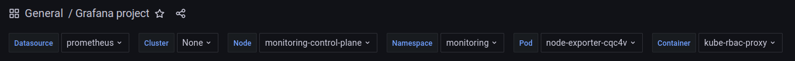
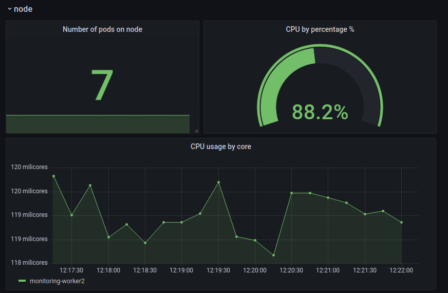
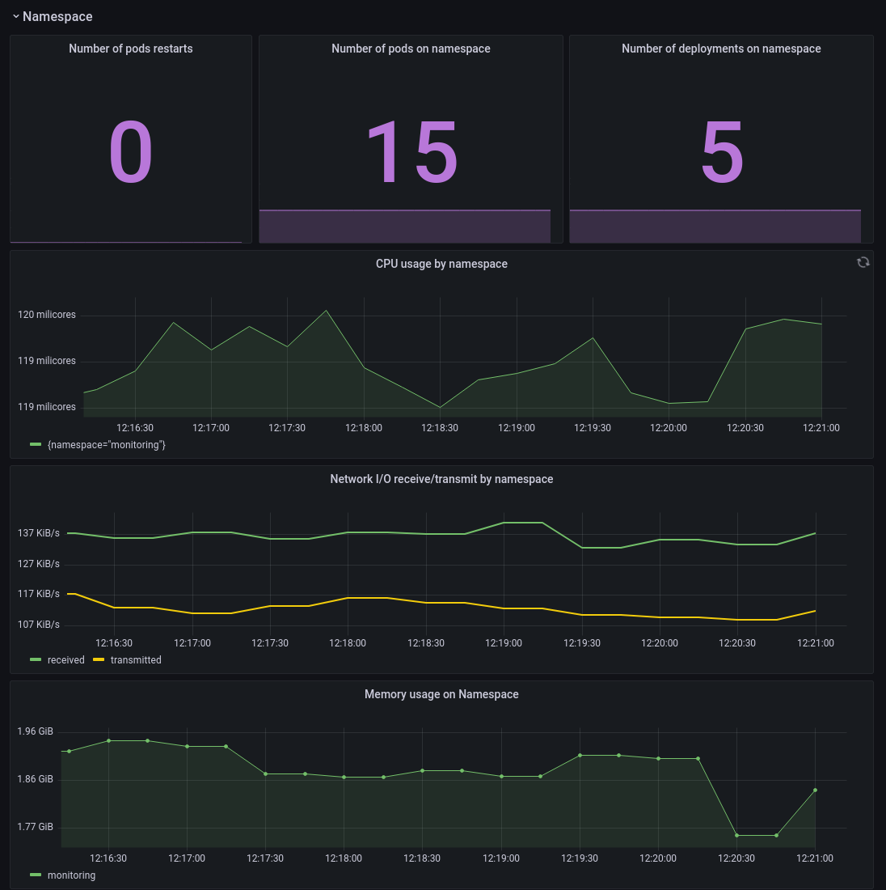
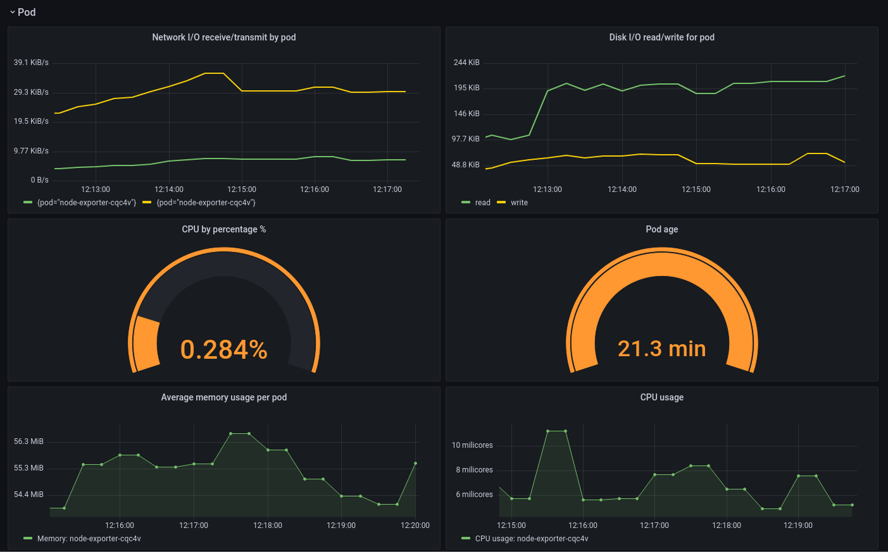
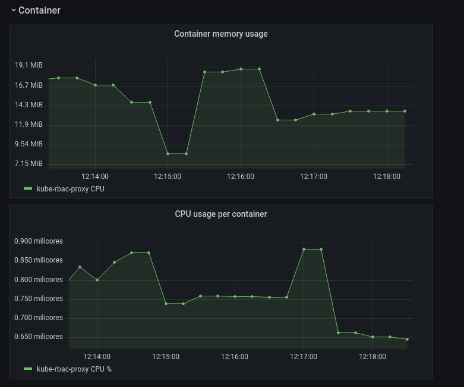

# Grafana Dashboard Project

In this project I've created a custom Grafana dashboard to monitor a kubernetes cluster hosted on Kind nodes, using a Prometheus datasource. 
The dashboard applies chained variables (The cluster is running a namespace, containers, and pods, on nodes), and monitors several parameters, including CPU usage, memory usage, network activity, etc.

The dashboard can be viewd by downloading the [this JSON file ](Grafana_project.json), and then importing it into Grafana by clicking the **+** sign on the menu, choosing the "Import" option > Upload JSON file.

## The Dashboard

### Chained Variables:

### Node:

### Namespace:

### Pod:

### Container:

